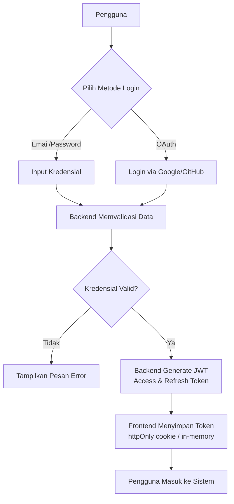
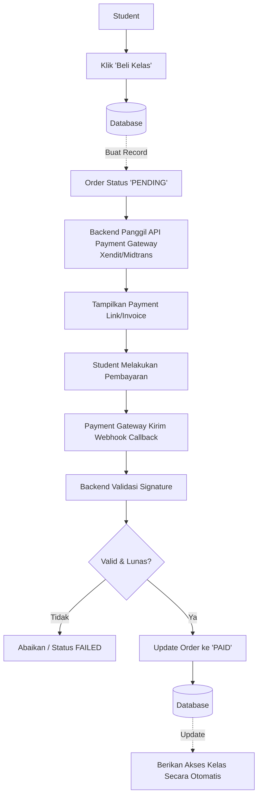
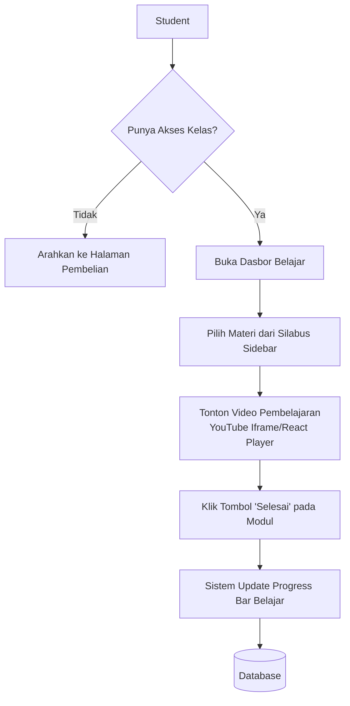
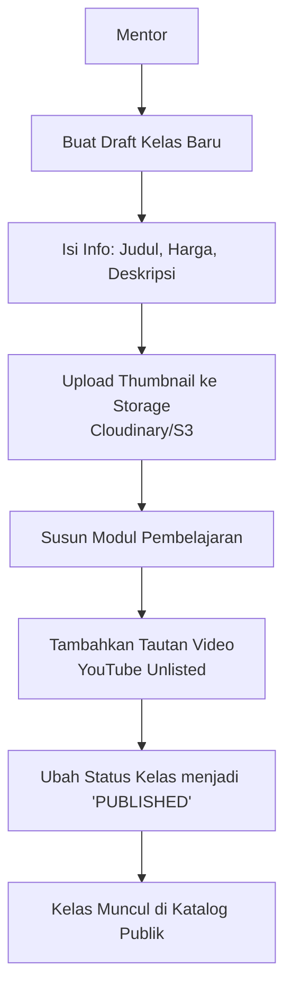
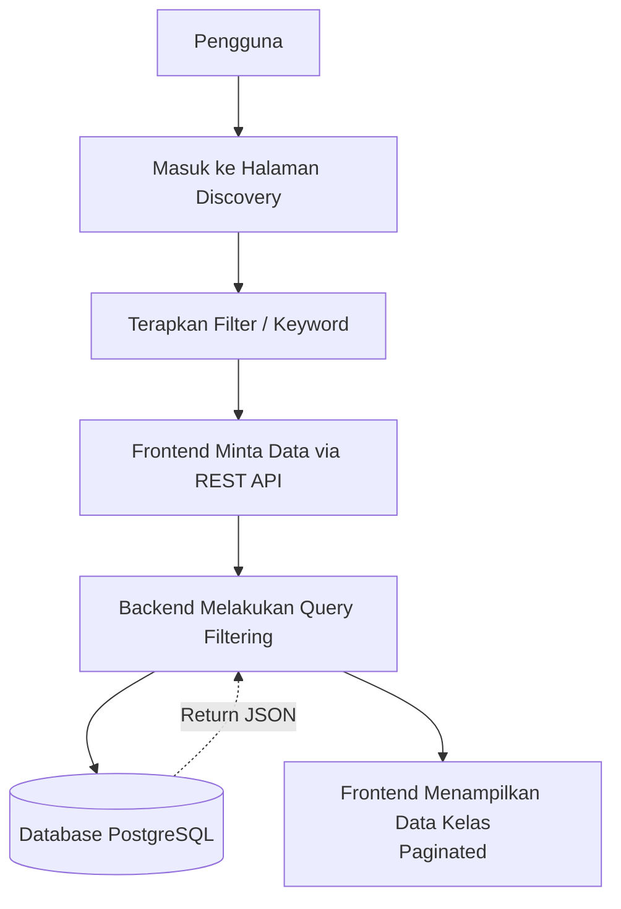

# Flowchart Sistem Coding Study

Dokumen ini memuat flowchart untuk alur-alur utama yang didefinisikan pada bagian **Fitur Sistem (Bagian 3)** dari dokumen System Requirements Specification (SRS).

## 1. Alur Autentikasi dan Manajemen Sesi
Menggambarkan proses login/registrasi pengguna hingga mendapatkan akses.

## 2. Alur Transaksi dan Checkout
Menggambarkan langkah-langkah pembelian kelas, berinteraksi dengan sistem internal dan payment gateway eksternal.

## 3. Alur Dasbor Belajar (Learning Experience)
Menggambarkan interaksi Student saat mengonsumsi materi kelas.

## 4. Alur Manajemen Kelas (Mentor)
Menggambarkan proses Mentor dalam membuat silabus dan mempublikasikan kelas.

## 5. Alur Katalog dan Pencarian Kelas
Menggambarkan interaksi saat pengguna mencari kelas di halaman utama.

