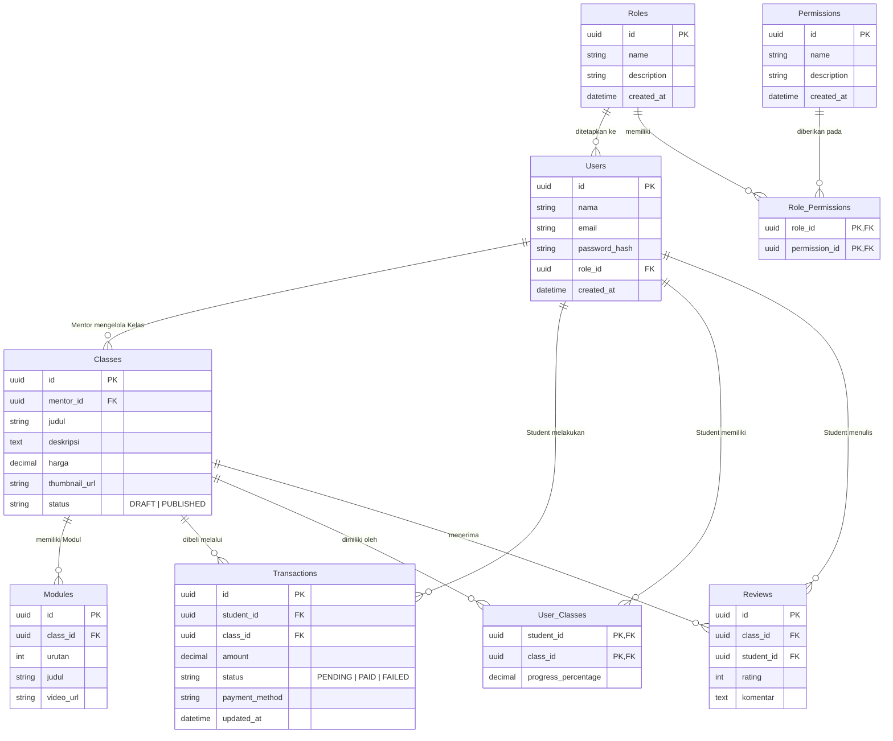

# Entity Relationship Diagram (ERD) - Coding Study

Berdasarkan bagian **Kebutuhan Data (Bagian 6)** dari dokumen System Requirements Specification (SRS), berikut adalah Entity Relationship Diagram (ERD) dari sistem **Coding Study**.

## Relasi Kunci:
1. **Roles ke Users (1:N):** Setiap peran (Role) dapat dimiliki oleh banyak pengguna.
2. **Roles dan Permissions (M:N) direpresentasikan oleh `Role_Permissions`:** Sebuah peran dapat memiliki banyak izin (Permissions), dan satu izin dapat diterapkan ke banyak peran.
3. **Users (Mentor) ke Classes (1:N):** Seorang Mentor dapat membuat banyak kelas.
4. **Classes ke Modules (1:N):** Setiap kelas dapat memiliki banyak modul video.
3. **Users (Student) ke Transactions (1:N):** Seorang siswa dapat melakukan banyak transaksi pembelian.
4. **Classes ke Transactions (1:N):** Sebuah kelas dapat dibeli dalam banyak transaksi.
5. **Users (Student) dan Classes (M:N) direpresentasikan oleh `User_Classes`:** Siswa dapat memiliki banyak kelas, dan kelas dapat dimiliki oleh banyak siswa. Tabel pivot ini juga digunakan untuk melacak `progress_percentage`.
6. **Users (Student) dan Classes (M:N) direpresentasikan oleh `Reviews`:** Siswa dapat memberikan ulasan untuk kelas yang telah dimilikinya.
