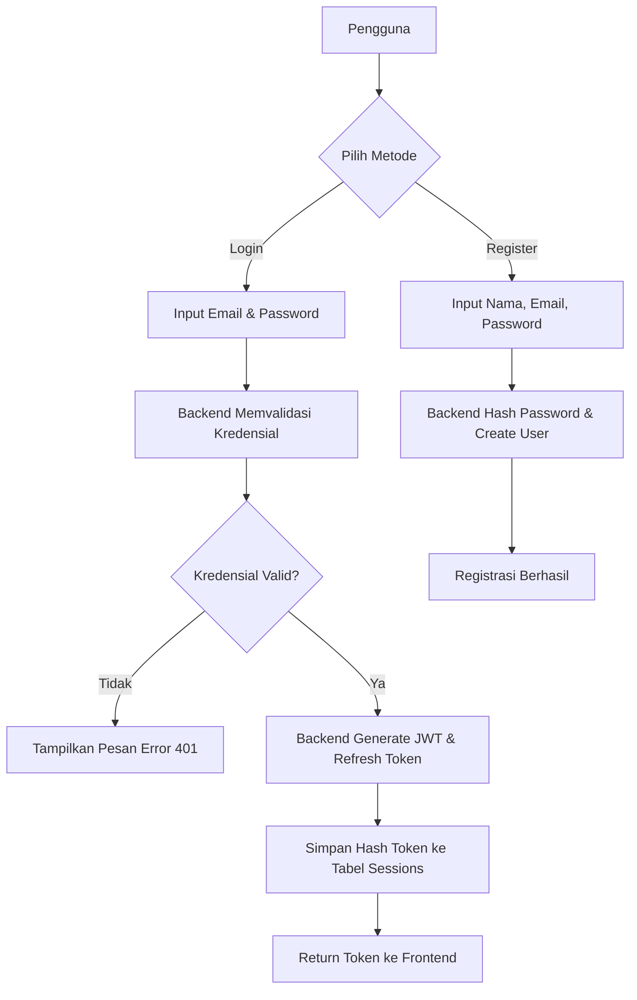
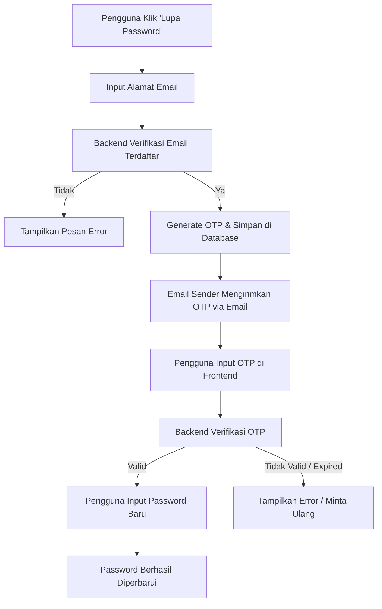
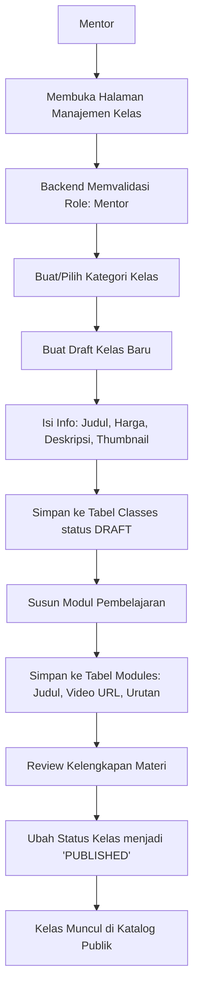
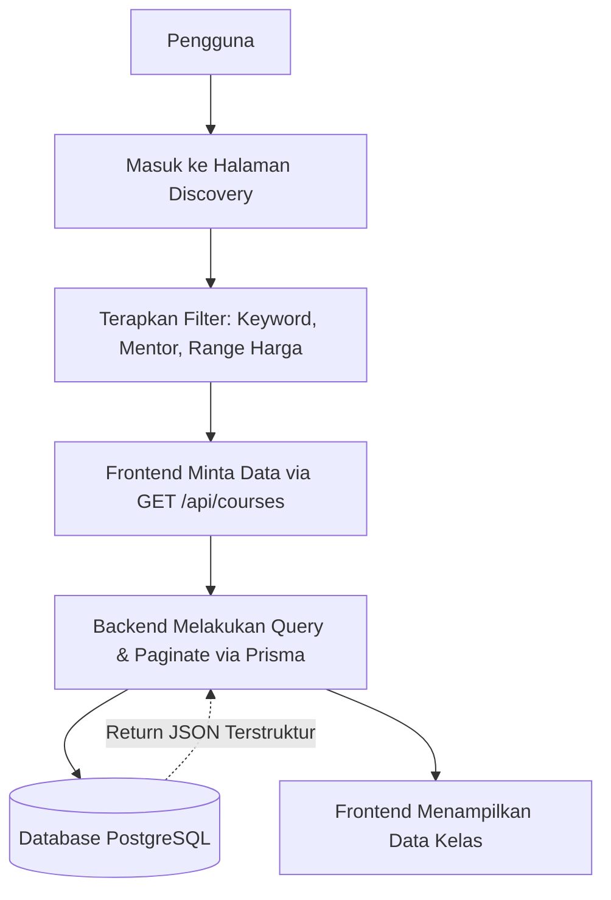
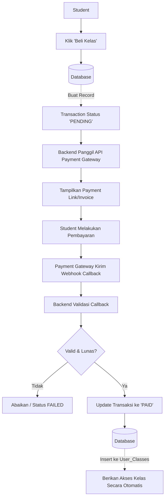
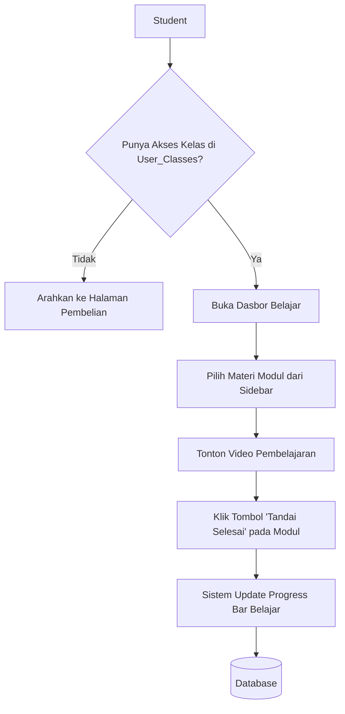

# Flowchart Sistem Coding Study

Dokumen ini memuat flowchart untuk alur-alur utama yang didefinisikan pada bagian **Fitur Sistem (Bagian 3)** dari dokumen System Requirements Specification (SRS).

## 1. Alur Autentikasi dan Manajemen Sesi
Menggambarkan proses login/registrasi pengguna hingga mendapatkan akses dan menyimpan sesi.



## 2. Alur Lupa Password dan OTP (Future Phase)
Menggambarkan proses reset password menggunakan OTP yang dikirimkan via Email Sender.



## 3. Alur Onboarding Pengguna (Baru)
Menggambarkan proses pengguna baru memilih topik atau kategori kelas yang diminati setelah melakukan pendaftaran.

```mermaid
graph TD
    A[User Login Berhasil] --> B{onboardingCompleted = true?}
    B -->|Ya| C[Arahkan ke Dasbor Utama]
    B -->|Tidak| D[Frontend Panggil /api/onboarding/categories]
    D --> E[Tampilkan Pilihan Kategori Minat]
    E --> F[User Memilih Kategori (Kirim Array of UUIDs)]
    F --> G[POST /api/onboarding/complete]
    G --> H[Backend Simpan ke Tabel UserPreference]
    H --> I[Update User: onboardingCompleted = true]
    I --> J[Arahkan ke Dasbor Utama]
```

## 4. Alur Manajemen Kelas (Mentor) & RBAC
Menggambarkan proses Mentor dalam membuat silabus. Memanfaatkan Role-Based Access Control (RBAC).



## 5. Alur Katalog dan Pencarian Kelas
Menggambarkan interaksi saat pengguna mencari kelas di halaman utama.



## 6. Alur Transaksi dan Checkout (Future Phase)
Menggambarkan langkah-langkah pembelian kelas, berinteraksi dengan sistem internal dan payment gateway eksternal.



## 7. Alur Dasbor Belajar / Learning Experience (Future Phase)
Menggambarkan interaksi Student saat mengonsumsi materi kelas.


